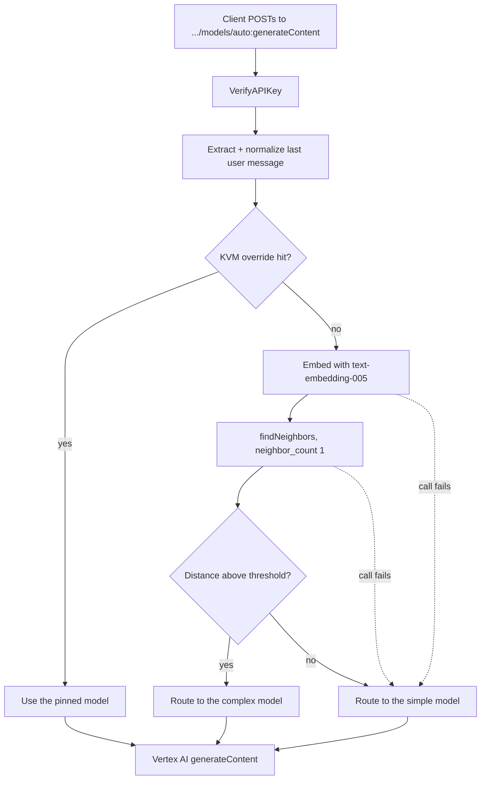

# **LLM Serving with Apigee**

## [Intelligent Model Routing Sample](llm_intelligent_routing_v1.ipynb)

Not every prompt needs your most capable model. This sample routes each request to a fast,
inexpensive model or a slower, more capable one based on the *semantic complexity* of the
prompt — decided inside Apigee, with no LLM call in the decision path.

The classifier is a 1-nearest-neighbor lookup against a Vertex AI Vector Search index that
contains only **complex** exemplars. A prompt that lands close to one is treated as complex.
A prompt that lands far from all of them is not. Flash is the default; Pro is the opt-in.

<!-- TODO: replace this Mermaid diagram with images/arch.png when one is available -->



### Why a single-class index

An earlier version of this idea indexed both simple and complex exemplars and read the label
off the nearest neighbor's ID. That design records a similarity distance but never compares
it to anything, so an off-topic prompt gets routed by whichever exemplar happens to be
nearest — however far away it is.

Indexing **only** complex exemplars makes the threshold the decision boundary. There is no
other signal to fall back on, so the threshold cannot be quietly ignored. It also gives a
safe failure mode: anything the classifier cannot place goes to the cheaper model with a
stated reason rather than to an arbitrary one.

### Benefits

* **Cost control**: short, routine prompts stop consuming your most expensive model.
* **No added latency from a router LLM**: the decision is one embedding call plus one vector
  lookup, not a model invocation.
* **Auditable decisions**: every response carries the model chosen, the reason, and the
  similarity distance.
* **Safe degradation**: if the embeddings API or the vector index is unavailable, requests
  still succeed on the cheaper model and say so.

### The request

The literal model name `auto` tells the gateway that model selection is its job:

```sh
curl -i --location \
  "https://$APIGEE_HOST/v1/samples/llm-intelligent-routing/v1/projects/$PROJECT_ID/locations/$REGION/publishers/google/models/auto:generateContent" \
  --header "Content-Type: application/json" \
  --header "x-apikey: $APIKEY" \
  --data '{"contents":[{"role":"user","parts":[{"text":"What is the capital of France?"}]}]}'
```

### The response headers

| Header | Meaning |
| --- | --- |
| `x-apigee-selected-model` | The model the request was actually sent to |
| `x-apigee-routing-reason` | One of `kvm_override`, `complex_match`, `no_complex_match`, `classifier_unavailable` |
| `x-apigee-routing-distance` | The nearest-neighbor distance, or `n/a` when no search ran |

### Tuning the router

The entire classifier is [config/complex-examples.json](config/complex-examples.json) — 18
labelled complex prompts. To retune, edit that file and re-run
`./deploy-llm-intelligent-routing.sh`; upserts are keyed by datapoint ID, so edits replace
rather than duplicate.

`ROUTING_MIN_SIMILARITY` in [env.sh](env.sh) is the decision boundary. **The default of
`0.75` is a starting point, not a validated constant.** The notebook prints a table of real
distances for a range of prompts — use it to pick a value that separates your traffic.

### Pinning specific prompts

[config/env\_\_envname\_\_llm-intelligent-routing-overrides\_\_kvmfile\_\_0.json](config/env__envname__llm-intelligent-routing-overrides__kvmfile__0.json)
seeds a KVM of exact prompt→model pins. A hit short-circuits the embedding call entirely,
which saves a round trip for known-hot prompts. Keys are matched after lowercasing and
trimming, so they must be written lowercase. Matching is exact — punctuation differences
will not match.

### Scope

This sample handles non-streaming `:generateContent` only. `:streamGenerateContent` is out
of scope.

### Get started

Proceed to this [notebook](llm_intelligent_routing_v1.ipynb) and follow the steps in the
Setup and Testing sections.
