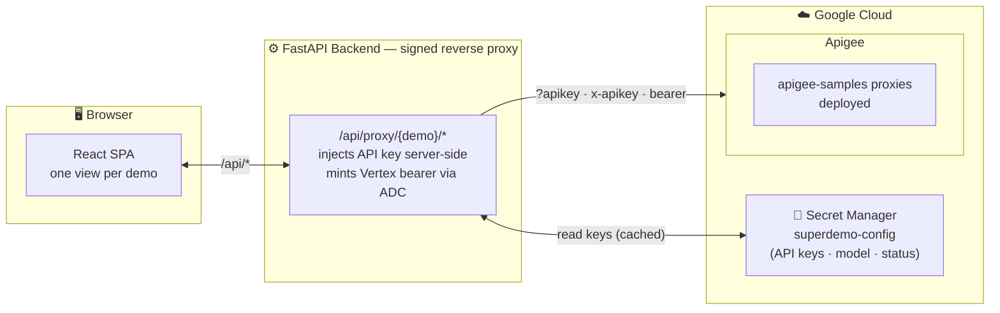

# Superdemo

A browser-based playground for a set of Apigee proxies from the [apigee-samples repo](https://github.com/GoogleCloudPlatform/apigee-samples). It replaces hand-rolled `curl` commands with a UI that visualizes Apigee in action. See **Wired-up demos** below for the full list of available proxies.

A FastAPI backend reads the deployed API keys from Google Cloud Secret Manager and acts as a signed reverse proxy, so keys never reach the browser. A React SPA renders one view per demo and talks only to the backend.

## Architecture

## Wired-up demos

- **Basic Quota** — Demonstrates Apigee Quota policies. Trial tier allows 10 requests/minute. Premium tier allows 1000 requests/hour.
- **LLM Security v2** — Routes prompts through Google Cloud Model Armor for threat protection before forwarding to Vertex AI.
- **LLM Rate Limiting** — Demonstrates Apigee's LLMTokenQuota AI policy. Bronze tier allows 2000 tokens per 5 minutes; silver allows 5000. Same prompt is sent to both tiers in parallel.
- **MCP Server** — Apigee serves as an MCP server: dynamically discovers tools from Apigee API hub specs and exposes them to a streaming AI agent.
- **Cloud Logging** — Apigee MessageLogging policy writes a structured entry to Google Cloud Logging on every request.
- **Threat Protection** — Apigee RegularExpressionProtection blocks SQL keywords in query params; JSONThreatProtection rejects oversized JSON payloads.

## Getting Started

- **[Setup & local dev guide → SETUP.md](SETUP.md)** — prerequisites, one-time proxy deploy, running locally, and testing.
- **[Cloud Run deploy guide → DEPLOY.md](DEPLOY.md)** — optionally host the app on Cloud Run with Firebase Google sign-in and an access allowlist.
- **[Presenter guide → GUIDE.md](GUIDE.md)** — a walkthrough of each demo: what to click, what to say, what the audience should notice.
