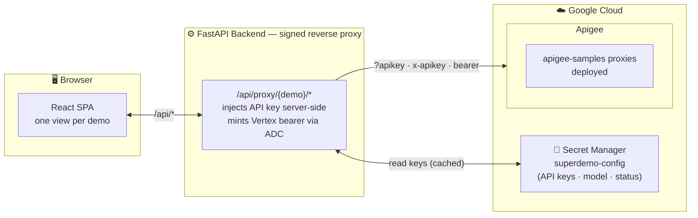

# Superdemo

A browser-based playground for a set of Apigee proxies from the [apigee-samples repo](https://github.com/GoogleCloudPlatform/apigee-samples). It replaces hand-rolled `curl` commands with a UI that visualizes Apigee in action. See **Wired-up demos** below for the full list of available proxies.

A FastAPI backend reads the deployed API keys from Google Cloud Secret Manager and acts as a signed reverse proxy, so keys never reach the browser. A React SPA renders one view per demo and talks only to the backend.

## Architecture

## Wired-up demos

- **Basic Quota** — Demonstrates Apigee Quota policies. Trial tier allows 10 requests/minute. Premium tier allows 1000 requests/hour.
- **LLM Security v2** — Routes prompts through Google Cloud Model Armor for threat protection before forwarding to Vertex AI.
- **LLM Rate Limiting** — Demonstrates Apigee's LLMTokenQuota AI policy. Bronze tier allows 2000 tokens per 5 minutes; silver allows 5000. Same prompt is sent to both tiers in parallel.
- **MCP Server** — Apigee serves as an MCP server: dynamically discovers tools from Apigee API hub specs and exposes them to a streaming AI agent.
- **Cloud Logging** — Apigee MessageLogging policy writes a structured entry to Google Cloud Logging on every request.
- **Threat Protection** — Apigee RegularExpressionProtection blocks SQL keywords in query params; JSONThreatProtection rejects oversized JSON payloads.
- **LLM Circuit Breaking** (`llm-circuit-breaking`) — a failover quota counts **upstream failures, not requests**: the counting policy is attached only to the primary target's FaultRule, so it increments solely when Vertex AI returns a 429 or another error. Once 2 failures land inside 2 minutes the breaker trips and traffic routes to a secondary Vertex AI region. superdemo deploys a patched revision of the sibling proxy that also returns `x-target-pool` / `x-target-region` response headers, so the UI can show which backend served each request. Normal traffic therefore stays on `primary`. To force a failover, the UI's **Break the primary** button sends requests for a model Vertex AI does not publish; the resulting 404 feeds the same counter a 429 would, so the breaker opens deterministically. (The sibling sample's notebook instead fans out ~90 requests via Cloud Tasks to exhaust the project's Gemini quota — but Gemini 2.5 runs under [dynamic shared quota](https://docs.cloud.google.com/vertex-ai/generative-ai/docs/dynamic-shared-quota), which has no per-project limit to exceed, so that trigger is not reliable.) Note the quota is global — it is shared across everyone calling the deployment.
- **Per-User Token Limits** (`llm-token-limits-per-user`) — LLM token quotas keyed on an `x-userid` header rather than the app. Two users share one API key but get independent token budgets.

`SECONDARY_REGION` is optional (defaults to `us-east1`). It is the failover region for the LLM Circuit Breaking demo; it must differ from `REGION` for the failover to be visible.

## Getting Started

- **[Setup & local dev guide → SETUP.md](SETUP.md)** — prerequisites, one-time proxy deploy, running locally, and testing.
- **[Cloud Run deploy guide → DEPLOY.md](DEPLOY.md)** — optionally host the app on Cloud Run with Firebase Google sign-in and an access allowlist.
- **[Presenter guide → GUIDE.md](GUIDE.md)** — a walkthrough of each demo: what to click, what to say, what the audience should notice.
